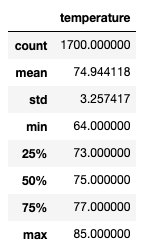
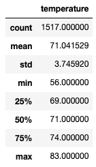

# Overview:
In this analysis I am presenting data to W. Avy in order to secure an investment for my ice cream stand/surf shop in Oahu.  My analysis focuses on temperature and precipitation in order to determine if the ice cream & surfing business will be successful on that island.  In order to best present this informaton, I used Flask apps and sqlalchemy in order to illustrate my findings.

# Results:
- The most important insight to take away from this analysis is that the temperature on Oahu is nearly as nice in December as it is in June.  This means that Oahu maintains a fairly consistent 70-75 degrees throughout the year, which are ideal temperatures for the ice cream & surfing business.

JUNE:

DECEMBER:

- Another important insight is that the maximum temperature for both June and December ranges between 80-85 degrees.  This indicates that the weather does not get uncomfortably hot at any time, and does not get uncomfortably cold during the winter.  This further affirms that Oahu would be a good location for the new business.

- Finally, the minimum temperatures for both June and December range between 56-64 degrees.  There is a larger variance here, indicating that the temperature does drop more in the evening during the winter months.  Using this statistic along with what we've learned about the maximum temperature, we can determine that - while the weather does get cooler in the wintertime - there is still a period of time during the day in which the temperature would allow for surfing and ice cream.  

# Summary: 
My analysis illustrates that the weather in Oahu remains relatively consistant throughout the year, with maximum temperatures ranging between 80-85 degrees in both June and December.  A consistent yearly temperature means that my ice cream and surfing shop would maintain business during the winter months.  Additionally, the average temperature consistantly ranges between 70-75 degrees which is perfect weather for my new business.  There are two additional queries that I might run in order to more accurately predict the success of my business.  First, I would try to determine the average temperature per hour during the day.  If I am able to determine that the average low temperatures only occur in the early hours of the morning, it would allow me to dispell concerns about the average minimum temperatures and wheter or not that would drive off customers.  Secondly, I would try to determine the temperature vs. percipitation to determine how many days between 70-75 degrees also experience percipitation. 

